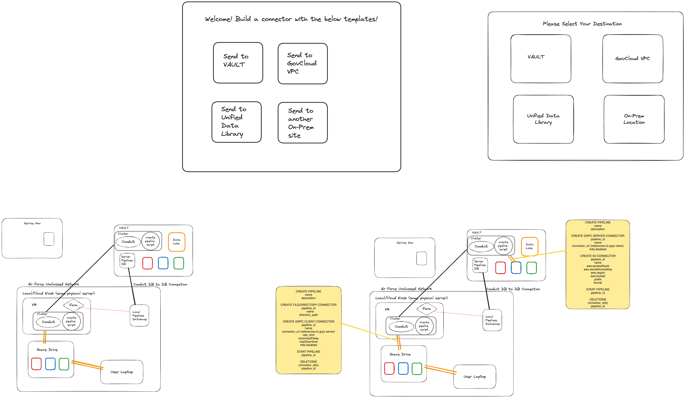
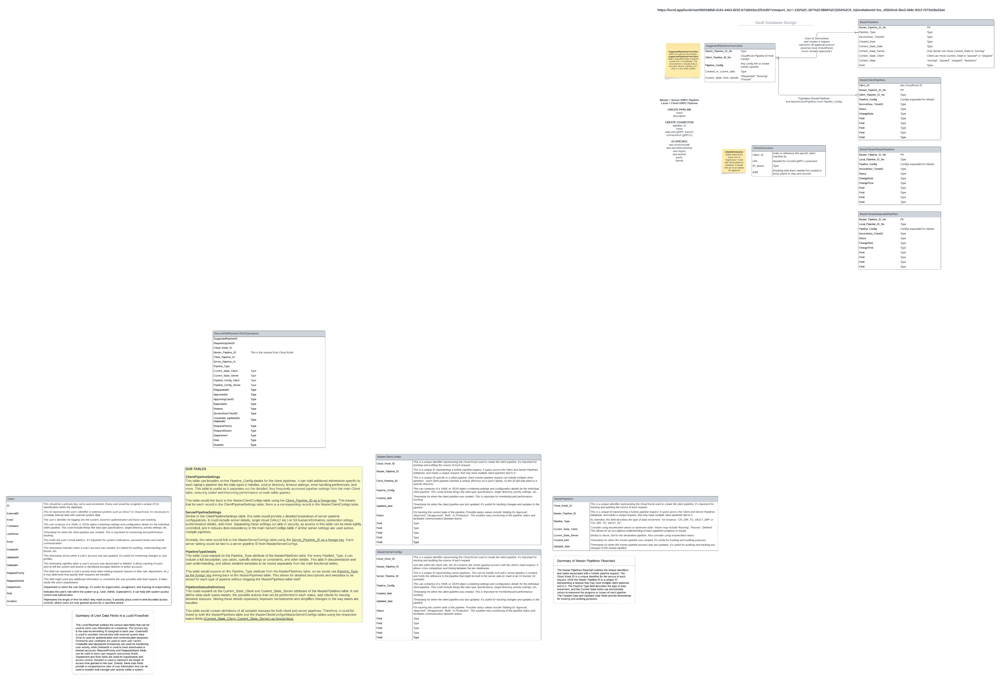
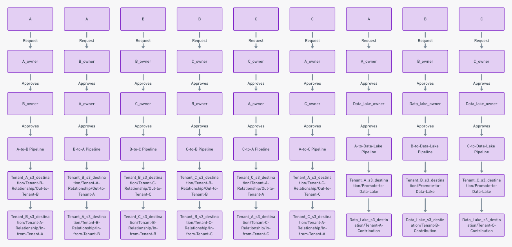
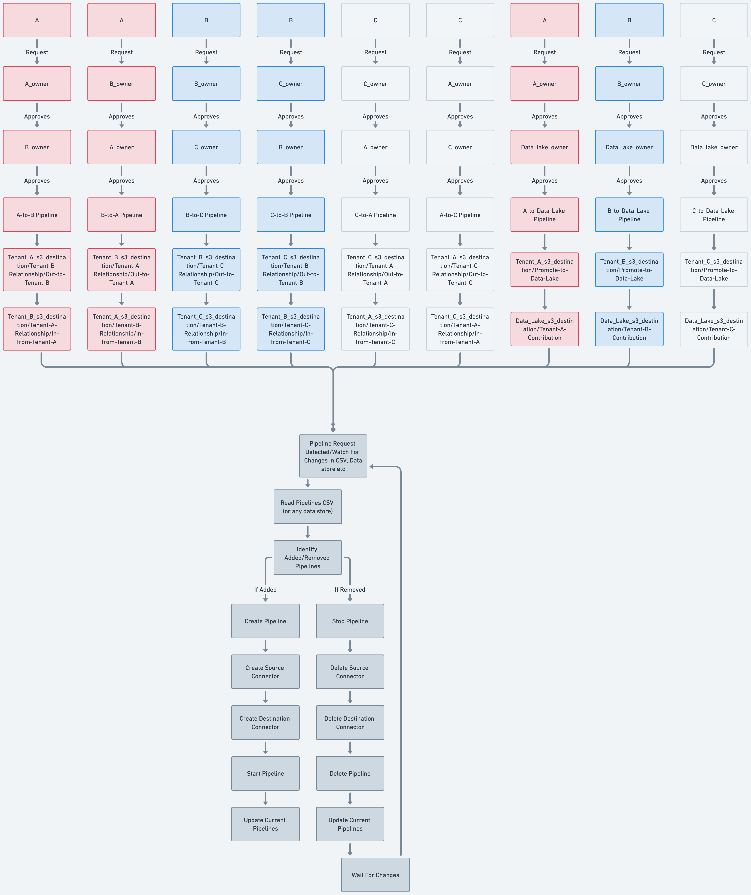

# Cloud Kiosk Project


## Overview

This project is a Minimum Viable Product (MVP) designed for a federal initiative, aimed at creating a cloud-based shared drive solution similar to Google Drive. The goal is to enable synchronization across various locations and the cloud, utilizing the Conduit Binary and Python without any additional libraries.

## Features

- **Cloud Synchronization**: Seamlessly sync files and data across multiple locations.
- **User-Friendly Interface**: Designed for ease of use, allowing users to manage their files effortlessly.
- **Robust API Integration**: Utilizes the Conduit platform for creating and managing pipelines and connectors.

## Architecture

The project is structured around the following components:

- **Pipelines**: Define the data flow between different sources and destinations.
- **Connectors**: Facilitate the connection between the pipelines and the data sources/destinations.
- **Audit Logging**: Tracks the creation, modification, and deletion of pipelines and connectors for accountability.

## Getting Started

### Prerequisites

- Python 3.x
- Conduit platform

### Installation and Running

1. Clone the repository:
   ```bash
   git clone git@github.com:tsinghgill/multi-pipeline-example.git
   cd multi-pipeline-example
   ```

2.  Add a sample pipeline to the pipelines.csv, this will represent a service ticket into ServiceNow for the MVP:
   ```bash
   A,A_owner,B_owner,A-to-B,Moves-from-A-to-B,A-to-B_source,tenant-a-demo,Tenant-B-Relationship/Out-to-Tenant-B,A-to-B_destination,tenant-b-demo,Tenant-A-Relationship/In-from-Tenant-A,json
   ```

3.  Run the conduit binary. For more information on getting the latest conduit binary, visit the conduit docs: https://conduit.io/docs/

### Diagrams and Resources





